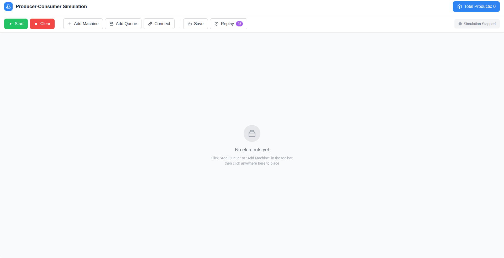
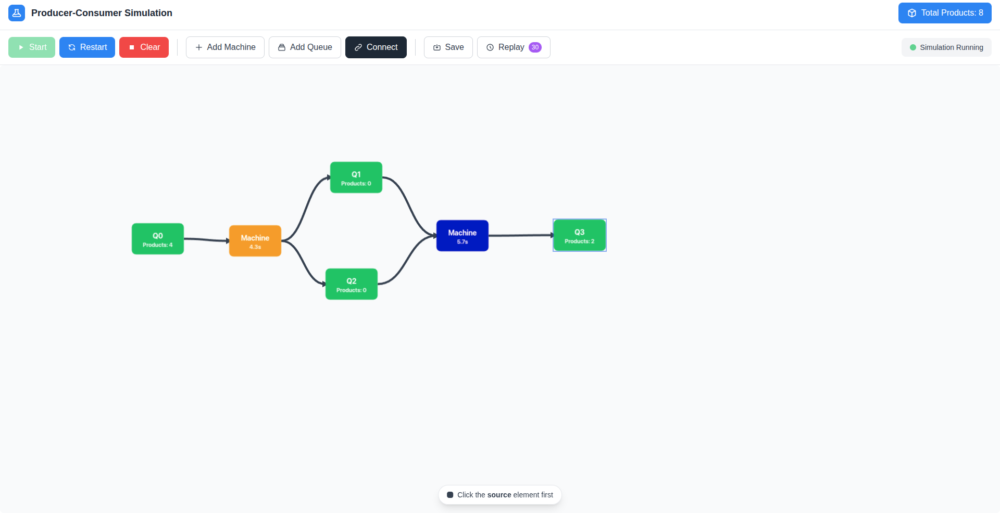
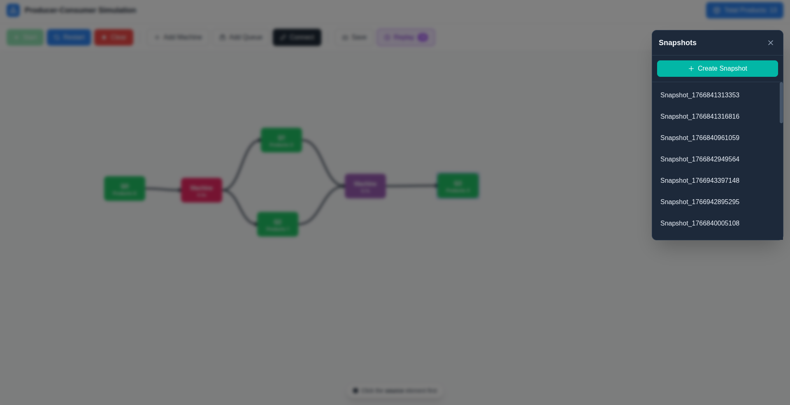
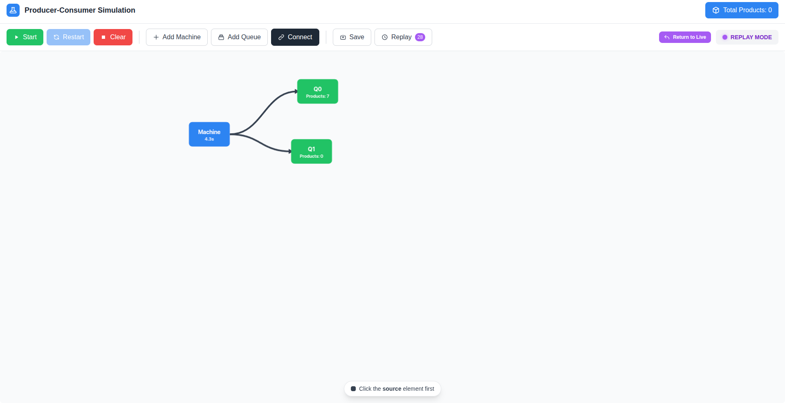

# Producer-Consumer Simulation

## Overview

A full-stack web application that visually simulates the **Producer-Consumer** concurrency pattern. Users can build custom processing pipelines by placing **Queues** and **Machines** on an interactive canvas, connecting them with directional edges, and watching products flow through the system in real time.

The backend handles all concurrency, thread-safe queues, multi-threaded machine workers, and guarded suspension, while the frontend provides a drag-and-drop canvas with live updates via **Server-Sent Events (SSE)**.

---

## Features

| Feature | Description |
|---|---|
| **Interactive Canvas** | Drag-and-drop placement of queues and machines using Fabric.js |
| **Real-Time Simulation** | Products flow through the pipeline with live visual updates |
| **Multi-Threaded Processing** | Each machine runs in its own thread with configurable processing times |
| **Server-Sent Events** | Real-time state synchronization between backend and frontend |
| **Snapshot & Replay** | Save simulation states to disk and replay them later (Memento Pattern) |
| **Auto-Generated Products** | Input generator automatically produces color-coded products into Q0 |
| **Visual Processing Feedback** | Machines change color to match the product they're currently processing |
| **Drag-to-Rearrange** | Move elements on the canvas and connections update in real-time |

---

## Screenshots

### Empty Canvas — Design Your Pipeline
> Place queues and machines on the canvas, then connect them to build your processing topology.



### Running Simulation
> Products are generated into Q0, consumed by machines, processed for a random duration, and forwarded to the next queue.



### Snapshot Replay — Time Travel Through States
> Save snapshots of your simulation, replay past states, and return to the live session at any time.





---

## Project Structure

```
producer-consumer-app/
├── backend/                    # Spring Boot 3.4 (Java 17)
│   └── src/main/java/com/producesconsumer/backend/
│       ├── config/             # CORS & thread pool configuration
│       ├── controller/         # REST + SSE endpoints
│       ├── dto/                # Request/Response DTOs
│       ├── model/              # Domain models (Queue, Machine, Product, etc.)
│       ├── observer/           # Observer pattern for queue events
│       └── service/            # Core simulation logic & snapshot management
│
└── frontend/                   # Angular 20 (Standalone Components)
    └── src/app/
        ├── components/         # Canvas, toolbar, snapshot list
        ├── models/             # TypeScript interfaces
        └── services/           # HTTP client & SSE integration
```

### Design Patterns Used

| Pattern | Where | Purpose |
|---|---|---|
| **Producer-Consumer** | `InputGenerator` → `Queue` → `MachineRunner` | Core simulation flow |
| **Observer** | `QueueObserver` / `QueueEventObserver` | Notify machines when products arrive, publish SSE events |
| **Guarded Suspension** | `MachineRunner.run()` | Machines `wait()` when input queues are empty, wake on `notify()` |
| **Memento** | `SimulationSnapshot` / `SnapshotService` | Save and restore complete simulation states |
| **Strategy** | Connection-based routing | Machines dynamically resolve input/output queues via connections |

---

## Tech Stack

### Backend
- **Java 17** with **Spring Boot 3.4.1**
- **Spring WebFlux** — Reactive `Sinks` for SSE broadcasting
- **Spring MVC** — REST endpoints for simulation control
- **Lombok** — Boilerplate reduction
- **ConcurrentHashMap / CopyOnWriteArrayList** — Thread-safe collections
- **ExecutorService (CachedThreadPool)** — Machine worker threads
- **Jackson** — JSON serialization for snapshots

### Frontend
- **Angular 20** with standalone components and signals
- **Fabric.js 7** — HTML5 Canvas rendering (drag-and-drop, connections, animations)
- **RxJS** — Observable-based HTTP and SSE handling
- **TailwindCSS 3** — Utility-first styling

---

## Getting Started

### Prerequisites

- **Java 17+** (JDK)
- **Node.js 18+** and **npm**
- **Maven** (included via `mvnw` wrapper)

### 1. Clone the Repository

```bash
git clone https://github.com/janamirashed/producer-consumer-app.git
cd producer-consumer-app
```

### 2. Start the Backend

```bash
cd backend
chmod +x mvnw
./mvnw spring-boot:run
```

The backend starts on **http://localhost:8080**.

### 3. Start the Frontend

```bash
cd frontend
npm install
npm start
```

The frontend starts on **http://localhost:4200**.

### 4. Open Your Browser

Navigate to [http://localhost:4200](http://localhost:4200) and start building your simulation!

---

## How to Use

1. **Add Queues**: Click "Add Queue", then click on the canvas to place them. The first queue (`Q0`) acts as the input source.
2. **Add Machines**: Click "Add Machine", then click on the canvas to place processing nodes.
3. **Connect Elements**: Click "Connect", then click a source element followed by a target element to create a directed edge.
4. **Start Simulation**: Click "Start" to begin. Products are auto-generated into `Q0` every 2–2.5 seconds.
5. **Save Snapshots**: Click "Save" to capture the current state to disk.
6. **Replay**: Click "Replay" to browse saved snapshots and load any past state.
7. **Return to Live**: When in replay mode, click "Return to Live" to restore your active session.
8. **Clear**: Click "Clear" to reset everything and start fresh.

---

## API Reference

All endpoints are prefixed with `/api/simulation`.

| Method | Endpoint | Description |
|---|---|---|
| `GET` | `/events` | SSE stream — real-time state updates |
| `GET` | `/state` | Get current simulation state |
| `POST` | `/queues` | Add a new queue `{ x, y }` |
| `DELETE` | `/queues/:id` | Delete a queue |
| `PATCH` | `/queues/:id/position` | Update queue position `{ x, y }` |
| `POST` | `/machines` | Add a new machine `{ x, y }` |
| `DELETE` | `/machines/:id` | Delete a machine |
| `PATCH` | `/machines/:id/position` | Update machine position `{ x, y }` |
| `POST` | `/connections` | Create connection `{ sourceId, sourceType, targetId, targetType }` |
| `DELETE` | `/connections/:id` | Delete a connection |
| `POST` | `/start` | Start the simulation |
| `POST` | `/stop` | Stop the simulation |
| `POST` | `/new` | Clear and create new simulation |
| `POST` | `/restart` | Restart simulation (clear product counts) |
| `GET` | `/snapshots` | List all saved snapshots |
| `POST` | `/snapshots` | Save a snapshot `{ label }` |
| `POST` | `/snapshots/:label/replay` | Load and replay a snapshot |
| `POST` | `/restore-live` | Restore the live session from backup |

### SSE Event Types

| Event | Payload | Description |
|---|---|---|
| `STATE_UPDATE` | Full `SimulationState` | Complete state synchronization |
| `QUEUE_EVENT` | `{ eventType, queueId, productId, productColor, newQueueSize }` | Product added/removed from queue |
| `MACHINE_UPDATE` | `Machine` object | Machine state changed (idle ↔ processing) |
| `MACHINE_FLASH` | `machineId` | Visual flash when a machine completes processing |
| `SIMULATION_STARTED` | — | Simulation started |
| `SIMULATION_STOPPED` | — | Simulation stopped |

---

## Documentation & Demo

- 📄 [Project Report](Report.pdf)
- 🎬 [Demo Video](Assets/Demo.mp4)
